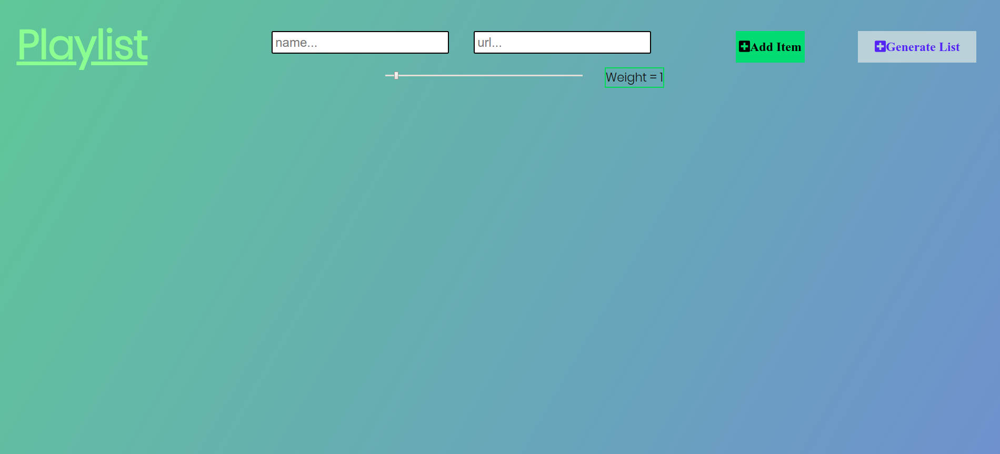
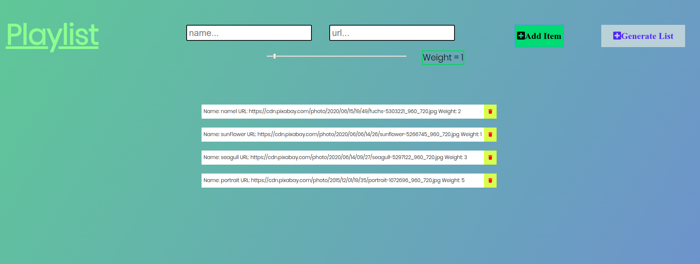
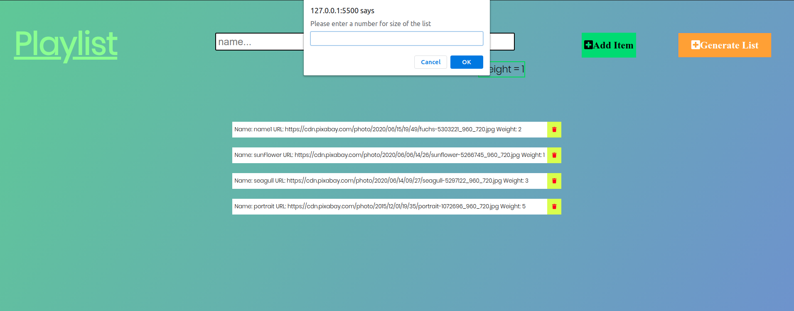
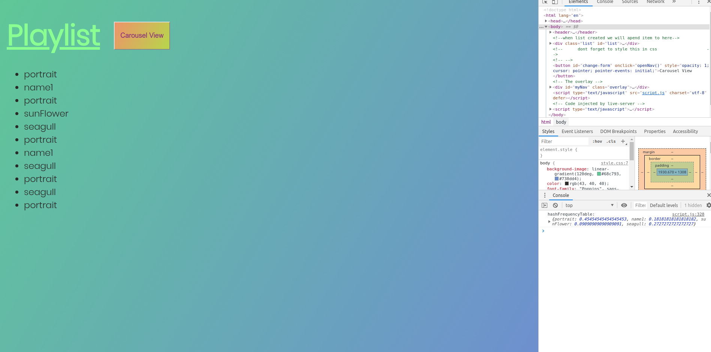
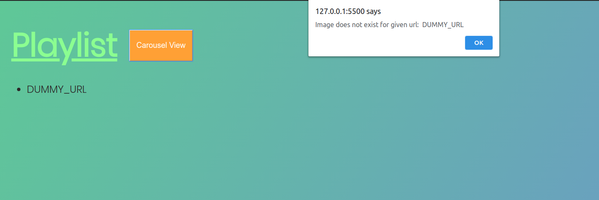
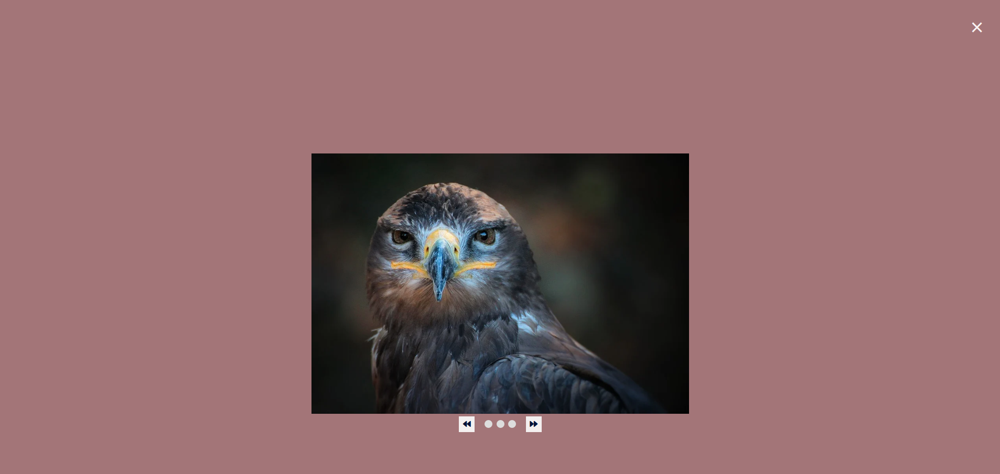

# Weighted-Playlist-Generator-and-Carousel-View-Challenge

This is the page when user logs into website.

User can directly fill the form and add item. If user forgets to give name or url, website throws an alert and deletes that faulty item.
The weight is between 1 and 10, it is never zero.

When user submits items via Generate List button it asks for input, input has to be integer, if it is not website throws an alert and asks input again.

If everything okay (this means these list can be created with this input) it creates playlist. Otherwise it is not possible to create list with given input or there are not enough item (example: A=1, B=7) and website throws an alert and refreshes website. And user can see frequency in console.log

When user clicks "Carousel View" if given one of the url is faulty (url is not correct) it throws an alert and says url is not correct. It refreshes the page and returns initial website. 

If there are no problems with url (images can be loaded) you can view it in Carousel form. 

